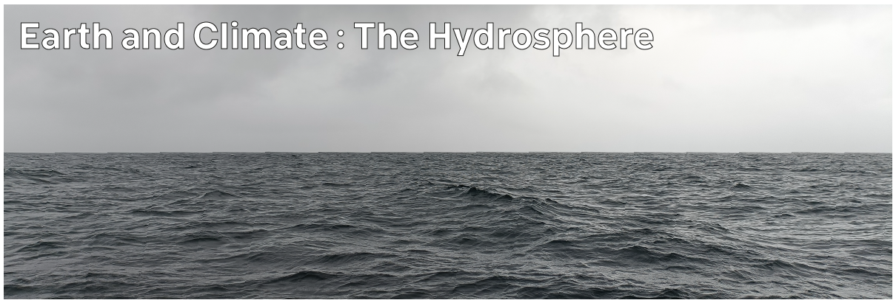

# Climate Hazards 1.02: Earth and Climate : The Hydrosphere

The water of the hydrosphere interacts significantly with the atmosphere and climate. Here, we'll introduce both the freshwater on land and the salt water of the oceans - important for understanding the overall climate and hazards from storms and floods.



---

[Previous](./1-01.md) | [Course Home](./README.md) | [Earth and Climate](./topic1.md) | [Next](./1-03.md)