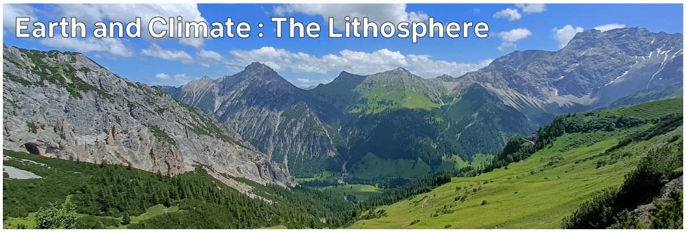

# Climate Hazards 1.03: Earth and Climate : The Lithosphere

The Lithosphere, or solid Earth, significantly influences the climate over the very long term; but more importantly, some aspects of the lithosphere can be significantly affected by climate hazards. We'll cover landslides in Week 4 - so here, we'll introduce the dynamic nature of the solid Earth.



---

[Previous](./1-02.md) | [Course Home](./README.md) | [Earth and Climate](./topic1.md) | [Next](./1-04.md)