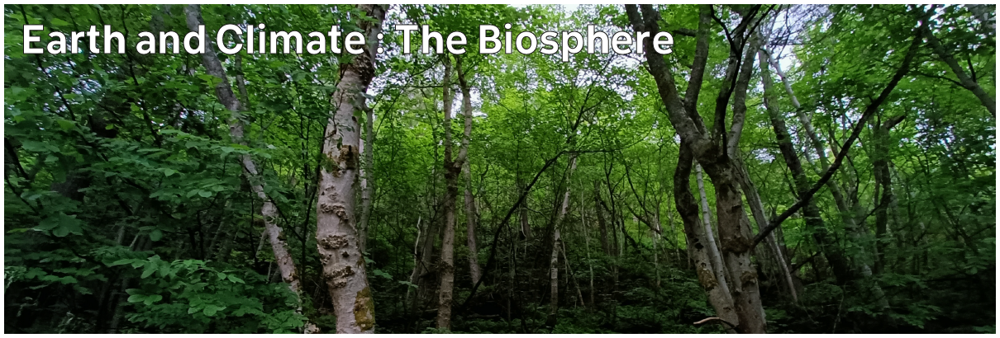

# Climate Hazards 1.04: Earth and Climate : The Biosphere

The biosphere can be significantly impacted by climate breakdown and climate hazards - which is a problem, because we're part of the biosphere, and so is the food we eat. The interactions of the biosphere with the atmosphere, hydrosphere, and lithosphere also substantially influence the occurrence and severity of climate hazards. Here, we'll introduce the concepts of biomes and ecosystems as background for exploring the impacts on and of the biosphere in later weeks.



---

[Previous](./1-03.md) | [Course Home](./README.md) | [Earth and Climate](./topic1.md) | [Next](./1-05.md)