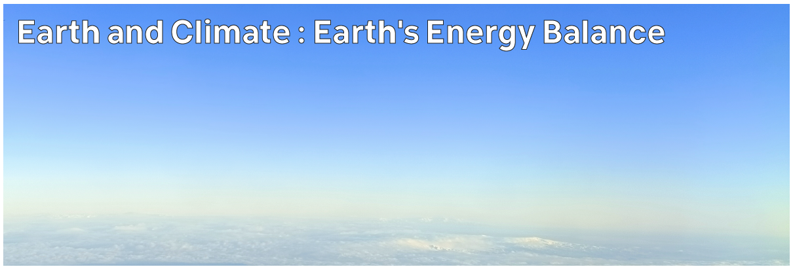

# Climate Hazards 1.05: Earth and Climate : Earth's Energy Balance

Earth is powered by energy from the Sun - but that energy isn't received equally over the Earth. Even more importantly, that energy can't all stay in the Earth surface system.



---

[Previous](./1-04.md) | [Course Home](./README.md) | [Earth and Climate](./topic1.md) | [Next](./1-06.md)