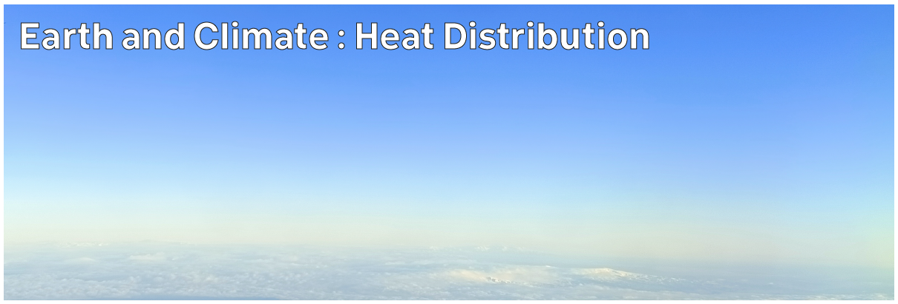

# Climate Hazards 1.06: Earth and Climate : Heat Distribution

Energy received by the Earth from the Sun as heat is distributed around the planet by the atmosphere.



---

[Previous](./1-05.md) | [Course Home](./README.md) | [Earth and Climate](./topic1.md) | [Next](./1-07.md)