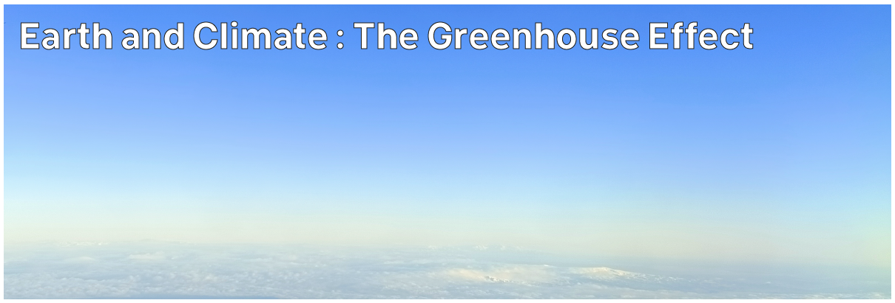

# Climate Hazards 1.07: Earth and Climate : The Greenhouse Effect

The atmosphere absorbs energy - but not equally. Specific gases absorb specific energy. And those gases can absorb energy trying to leave the Earth as easily as incoming energy from the Sun.



---

[Previous](./1-06.md) | [Course Home](./README.md) | [Earth and Climate](./topic1.md) | [Next](./1-08.md)