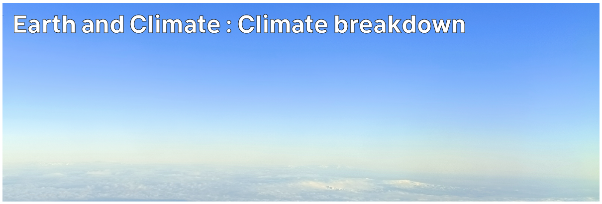

# Climate Hazards 1.08: Earth and Climate : Climate breakdown

Climate breakdown won't just see the atmosphere get warmer - there will be impacts in the hydrosphere and biosphere as well, all of which will affect us.



---

[Previous](./1-07.md) | [Course Home](./README.md) | [Earth and Climate](./topic1.md) | [Next](./topic2.md)