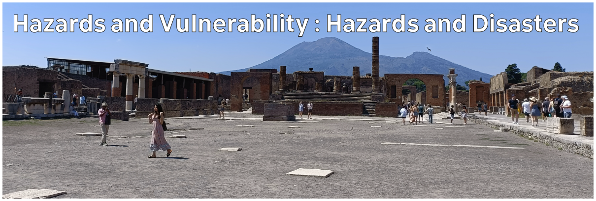

# Climate Hazards 2.01: Hazards and Vulnerability : Hazards and Disasters

Storms, floods, heatwaves, and wildfires are all natural events. What makes them a natural hazard, or a natural disaster?

[Download slides](./assets/lectures/2-01_hazards.pdf)



---

[Previous](./1-08.md) | [Course Home](./README.md) | [Hazards and Vulnerability](./topic2.md) | [Next](./2-02.md)