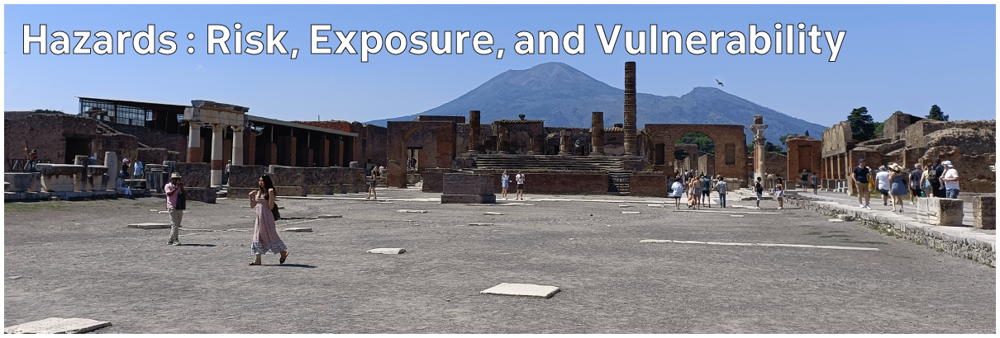

# Climate Hazards 2.02: Hazards and Vulnerability : Risk, Exposure, and Vulnerability

We talk about the risk from hazard events. If a person or think is in an area where a hazard might occur, it's possible that they might be affected by it. But that doesn't tell us how much they might be affected.

[Download slides](./assets/lectures/2-02_risk.pdf)



---

[Previous](./2-01.md) | [Course Home](./README.md) | [Hazards and Vulnerability](./topic2.md) | [Next](./2-03.md)