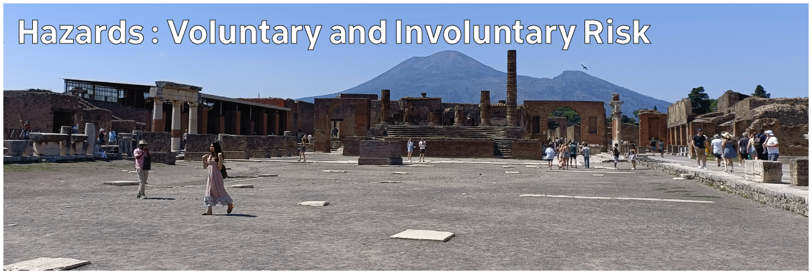

# Climate Hazards 2.03: Hazards and Vulnerability : Voluntary and Involuntary Risk

Everywhere is exposed to some level of risk. How much risk are you willing to accept? Do you know what risk you are taking? Do you have any choice?

[Download slides](./assets/lectures/2-03_voluntary_risk.pdf)



---

[Previous](./2-02.md) | [Course Home](./README.md) | [Hazards and Vulnerability](./topic2.md) | [Next](./2-04.md)