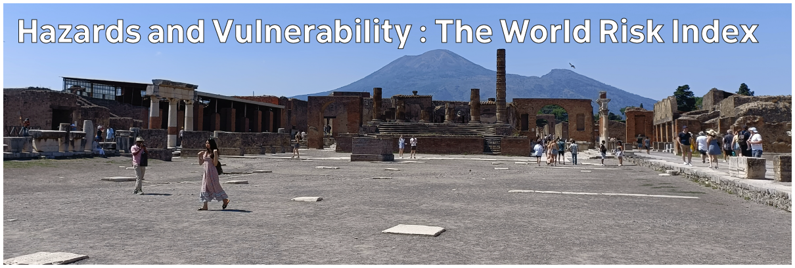

# Climate Hazards 2.04: Hazards and Vulnerability : The World Risk Index

The World Risk Index attempts to assess risk from natural hazards for every country in the world. It is not limited to climate hazards, but I think it's worth having a look and using it as a way of reinforcing the concepts involved in risk.

[Download slides](./assets/lectures/2-04_wri.pdf)



---

[Previous](./2-03.md) | [Course Home](./README.md) | [Hazards and Vulnerability](./topic2.md) | [Next](./2-05.md)