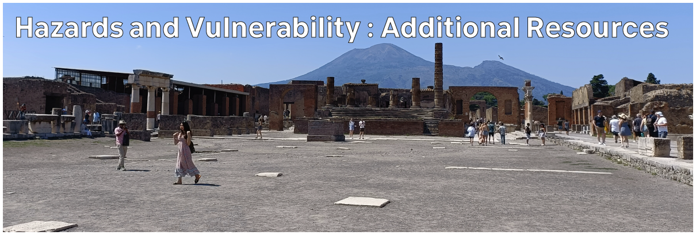

# Climate Hazards 2.05: Hazards and Vulnerability : Additional Resources

The lecture content hopefully serves as a good introduction to the topic of hazards and disasters, but there's a huge amount of content out there which can help you go deeper.

I highly recommend the book "At Risk", which you can find on the reading list (electronic and physical copies available through the library).

I would also highly recommend some of the publications by the UN IPCC (United Nations Intergovernmental Panel on Climate Change), and the UN Sendai Framework for Disaster Risk Reduction, and there's plenty of academic publications and NGO reports which highlight issues related to exposure and vulnerability. I've shared a couple of these below.

I've largely stayed away from more specific articles, simply because we haven't covered particular hazards yet - so I will be providing more of that kind of content in the next couple of weeks.

Now - I am also well aware that time is limited, and it can be very difficult to find time to sit and read long chapters. To that end, while I've provided links/PDFs for recommended reading material below, I've also used AI tools to generate audio overviews for each of these sources.

These audio overviews aren't a replacement for any of my content, or for reading the sources themselves, but hopefully they can be an additional useful resource for you - meaning you can get at least an introduction and overview to some of this content while you're travelling or doing something else when you can listen to something, but wouldn't be able to sit and read anything. You can download the files and listen on your own devices.

## Book Chapters

- Wisner, B., Blaikie, P., Cannon, T. and Davis, I. 2004 *At Risk: Natural hazards, people’s vulnerability and disasters*, Second Edition. Routledge. (Chapters 1-3)

    - [Download AI Audio Overview](./assets/audio/At_Risk.m4a)

## Reports

- Cardona, O.D., van Aalst, M.K., Birkmann, J., Fordham, M., McGregor, G., Perez, R., Pulwarty, R.S., Schipper, E.L.F., and Sinh, B.T. 2012 Determinants of risk: exposure and vulnerability. In: Field, C.B., Barros, V., Stocker, T.F., Qin, D., Dokken, D.J., Ebi, K.L., Mastrandrea, M.D., Mach, K.J., Plattner, G.-K., Allen, S.K., Tignor, M., and Midgley, P.M. (eds.) *Managing the Risks of Extreme Events and Disasters to Advance Climate Change Adaptation: A Special Report of Working Groups I and II of the Intergovernmental Panel on Climate Change (IPCC)*. Cambridge University Press, Cambridge, UK, and New York, NY, USA, pp. 65-108.

    - [Download PDF](https://www.ipcc.ch/site/assets/uploads/2018/03/SREX-Chap2_FINAL-1.pdf)

    - [Download AI Audio Overview](./assets/audio/SREX.m4a)

- Ara Begum, R., Lempert, R., Ali, E., Benjaminsen, T.A., Bernauer, T., Cramer, W., Cui, X., Mach, K., Nagy, G., Stenseth, N.C., Sukumar, R., and Wester, P. 2022 Point of Departure and Key Concepts. In: Pörtner, H.-O., Roberts, D.C., Tignor, M., Poloczanska, E.S., Mintenbeck, K., Alegría, A., Craig, M., Langsdorf, S., Löschke, S., Möller, V., Okem, A., and Rama, B. (eds.) *Climate Change 2022: Impacts, Adaptation and Vulnerability. Contribution of Working Group II to the Sixth Assessment Report of the Intergovernmental Panel on Climate Change*. Cambridge University Press, Cambridge, UK and New York, NY, USA, pp. 121–196, doi:[10.1017/9781009325844.003](https://doi.org/10.1017/9781009325844.003).

    - [Download PDF](https://www.ipcc.ch/report/ar6/wg2/downloads/report/IPCC_AR6_WGII_Chapter01.pdf)

    - [Download AI Audio Overview](./assets/audio/AR6_01.m4a)

- United Nations Office for Disaster Risk Reduction. 2015. *Sendai framework for disaster risk reduction 2015–2030*. [https://www.unisdr.org/we/inform/publications/43291](https://www.unisdr.org/we/inform/publications/43291).

    - [Download PDF](https://www.undrr.org/media/16176/download)

    - [Download AI Audio Overview](./assets/audio/Sendai_Framework.m4a)

## Academic Journal articles

- Kaijser, A. and Kronsell, A. 2013. Climate change through the lens of intersectionality. *Environmental Politics* **23**, 417–433. doi: [10.1080/09644016.2013.835203](https://doi.org/10.1080/09644016.2013.835203)

    - [Read Online](https://doi.org/10.1080/09644016.2013.835203)

    - [Download AI Audio Overview](./assets/audio/intersectionality.m4a)

- Zovko, M., Marković Vukadin, I., and Zovko, D. 2025 Understanding the IPCC Climate Risk-Centered Framework and Its Applications to Assessing Tourism Resilience. *Geographies* **5**, 45. doi: [10.3390/geographies5030045](https://doi.org/10.3390/geographies5030045)

    - [Read Online](https://doi.org/10.3390/geographies5030045)

    - [Download AI Audio Overview](./assets/audio/tourism_resilience.m4a)

---

[Previous](./2-04.md) | [Course Home](./README.md) | [Hazards and Vulnerability](./topic2.md) | [Next](./topic3.md)