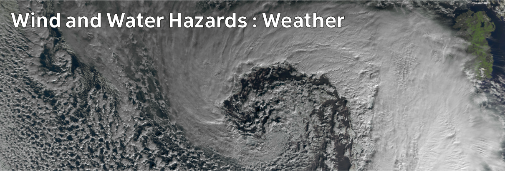

# Climate Hazards 3.01: Wind and Water Hazards : Weather

In order to understand weather hazards, we first need a quick look at some aspects of weather systems in general.

[Download slides](./assets/lectures/3-01_weather.pdf)



---

[Previous](./2-05.md) | [Course Home](./README.md) | [Wind and Water Hazards](./topic3.md) | [Next](./3-02.md)