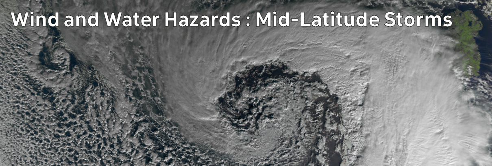

# Climate Hazards 3.02: Wind and Water Hazards : Mid-Latitude Storms

Ireland is affected by mid-latitude storm systems, also referred to as extratropical cyclones.

[Download slides](./assets/lectures/3-02_mlstorms.pdf)



---

[Previous](./3-01.md) | [Course Home](./README.md) | [Wind and Water Hazards](./topic3.md) | [Next](./3-03.md)