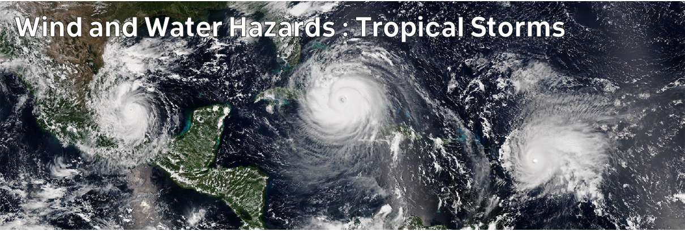

# Climate Hazards 3.03: Wind and Water Hazards : Tropical Storms and Hurricanes

Tropical storms aren't like the mid-latitude storms in Ireland, with no fronts involved - instead depending on warm air rising.

[Download slides](./assets/lectures/3-03_tstorms.pdf)



---

[Previous](./3-02.md) | [Course Home](./README.md) | [Wind and Water Hazards](./topic3.md) | [Next](./3-04.md)