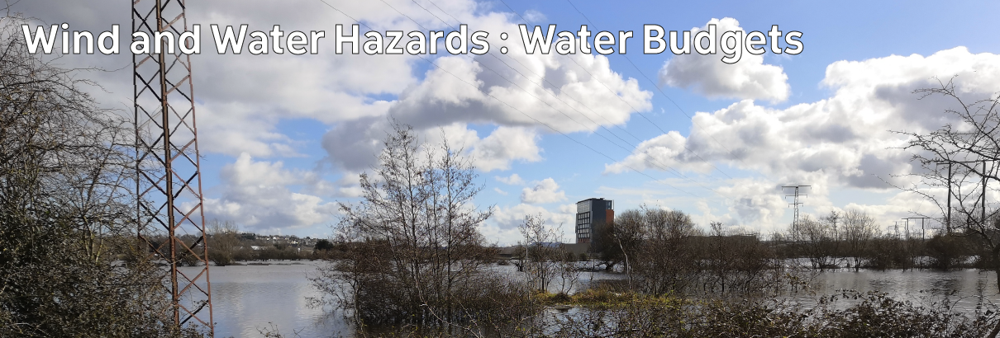

# Climate Hazards 3.04: Wind and Water Hazards : Water Budgets

Both mid-latitude and tropical storms can cause flooding, as can rainfall from other weather systems. In order to understand why flooding happens, it's useful to think in terms of the input and output of water to an area: the water budget.

[Download slides](./assets/lectures/3-04_wbudgets.pdf)



---

[Previous](./3-03.md) | [Course Home](./README.md) | [Wind and Water Hazards](./topic3.md) | [Next](./3-05.md)