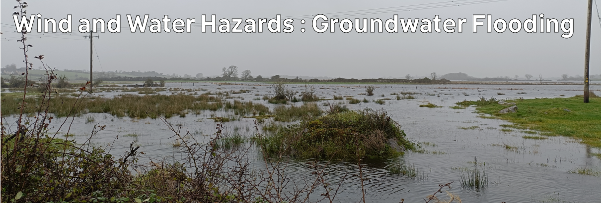

# Climate Hazards 3.05: Wind and Water Hazards : Groundwater Flooding

Not all flooding is the same, so let's first look at groundwater flooding.

[Download slides](./assets/lectures/3-05_groundwater.pdf)



---

[Previous](./3-04.md) | [Course Home](./README.md) | [Wind and Water Hazards](./topic3.md) | [Next](./3-06.md)