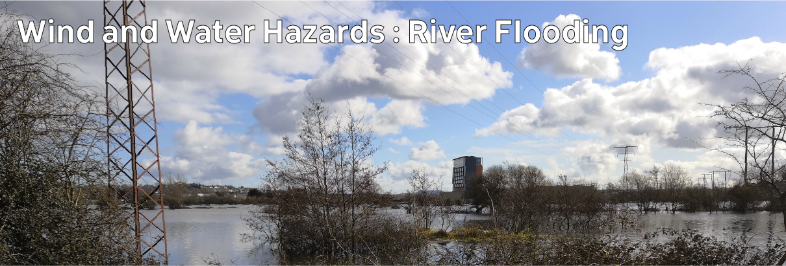

# Climate Hazards 3.06: Wind and Water Hazards : River Flooding

And now flooding from rivers

[Download slides](./assets/lectures/3-06_fluvial.pdf)



---

[Previous](./3-05.md) | [Course Home](./README.md) | [Wind and Water Hazards](./topic3.md) | [Next](./3-07.md)