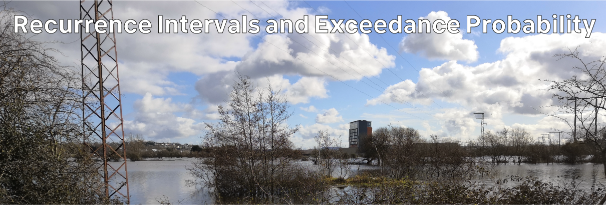

# Climate Hazards 3.07: Wind and Water Hazards : Recurrence Intervals and Exceedance Probability

In this week's tutorial, we discussed flooding recurrence intervals. This is critical in flood risk analysis – if you’re going to build a house in an area, it’s not enough to know the area hasn’t flooded recently. You want to know what the likelihood is of it flooding in the future too.

The standard most often talked about is the 100-year flood. But what exactly does that mean? A key concept here is exceedance probability.

Think about a flood of a particular size. What we want to know about this flood is, how often will it happen? But of course floods don’t happen on a schedule like clockwork. Instead, we can ask: what is the probability that a flood of this size will happen in any given year?

But we are not just interested in a flood of exactly this size. A flood which is bigger than exactly this size would have all the same consequences, and more. So, what we are really interested in knowing is the probability of a flood which exceeds this exact size – equal to or greater than. This is referred to as the exceedance probability for a flood of this size.

If the annual exceedance probability of a flood is 0.01, then there is a 1% chance that a flood that size or bigger will occur in any given year – one chance in one hundred, or once every one hundred years. This is commonly referred to as a one hundred year flood – and one hundred years is the recurrence interval for a flood of this size.

Similarly, a flood with an annual exceedance probability of 0.05 (5%) has five chances in one hundred, or one chance in twenty – a twenty year flood.

Of course, this doesn’t mean such a flood happens precisely every one hundred years. The probability is that such a flood would happen in one year out of one hundred – but, just because it happens one year doesn’t mean it won’t happen the next.

If we have records of water levels going back years, we can work out the recurrence intervals for floods of particular sizes, and determine the size of floods with different annual exceedance probabilities. This is the type of analysis done by hydrologists and insurance risk analysts regularly.

What we can do is calculate the annual exceedance probability and recurrence intervals for the water levels in each of these years, and then extrapolate that to calculate the size of a 100-year flood (annual exceedance probability of 1%). Here's how do to that:

1. Rank the water levels `1, 2, 3...` to the end, from highest to lowest. In our example in Excel, we used the formula `=RANK.EQ(B2,$B$2:$B$62)` in cell C3, filled down the column, to find these.

2. Calculate the Exceedance Probability from this as `Rank / (number of years + 1)`. You can think of this as the percentage of all these years that the water level for a particular year was equalled or exceeded - throwing in an extra year, because the water level might be lower than the lowest value in our dataset at some point. In our example in Excel, we used the formula `=C2/(COUNTA($C$2:$C$62)+1)` in cell D2, filled down, to calculate this.

3. Calculate the Recurrence Interval as `1 / Exceedance Probability`. In our example in Excel, we used the formula `=1/D2` in cell E2, filled down, to calculate this.
You now have the Exceedance Probability and Recurrence Interval for each year of the dataset, but we don’t yet know how often bigger events might occur. We can extrapolate the current dataset to explore such larger events. The easiest way to do this is by creating a graph.

    - In Excel, create a scatter plot with Recurrence Interval as the X-axis, and water level as the Y-axis `Insert > Scatter, Select Data, choose the Recurrence Interval data as Series X Values, choose the water level data as Series Y Values`.

    - Change the X-axis to logarithmic with a maximum value of 100 `right click on the axis, choose Format Axis, and select Logarithmic Scale in the panel which appears; then at the top of the panel, enter 100 as the Maximum under Bounds`.

    - Add a power trendline which extends to a Recurrence Interval of 100 years `right click on the data points on the graph and select Add Trendline; in the trendline options, choose Power, and enter 100 as Forward under Forecast; also select Display Equation On Chart`.

You should now see a curved trendline on your graph through all points, and extending to 100 years on the X-axis.

The water level where the trendline reaches 100 years is the forecast water level for a 100-year flood event. You can also use the trendline equation to calculate the value more exactly. The equation should be in the form `y = ax^b`; or to use the terms, `water level = a * recurrence interval^b`.

We can calculate the water level `y` for recurrence interval `x = 100 years` (i.e. `a * 100^b`). In our example, the formula was `y = 43.482x^0.0052`, so we calculated `43.482*100^0.0052 = 44.53583`

We can also use the equation the other way around. Given a water level `y`, can we calculate the recurrence interval `x` and hence exceedance probability for that water level, i.e. how many years would on average pass between water level readings of that size, and what is the probability that this water level would occur in any year.

In this case, we would know the value of `y` - the water level in question - and we would want to calculate the recurrence interval, `x`. So the equation will be `x = (y/a)^1/b`. The exceedance probability will then be `1/x`.

In our example, we looked at a water level of 45.0m, so the formula was `x = (45/43.482)^1/0.0052` = 734.4495 years.

This isn't just about flooding - we've used flooding as an example, but that's just because we have easy access to years of data thanks to the OPW's water level monitors. Exactly the same kind of analysis is possible for almost any kind of natural hazard event, where you have data for sizes at different times, and this is the type of analysis that researchers working on various types of hazard do frequently. Hopefully this helps to make sense of what a 10-year or 100-year or 1000-year event is, whether that’s a flood, a wildfire, a storm, a heatwave, or whatever else you might be interested in.

Link to [OPW's Hydro Data website](https://waterlevel.ie/hydro-data/#/overview/Waterlevel)

Download tutorial [Excel spreadsheet](./assets/tutorials/Recurrence_Intervals.xlsx)

---

[Previous](./3-06.md) | [Course Home](./README.md) | [Wind and Water Hazards](./topic3.md) | [Next](./topic4.md)