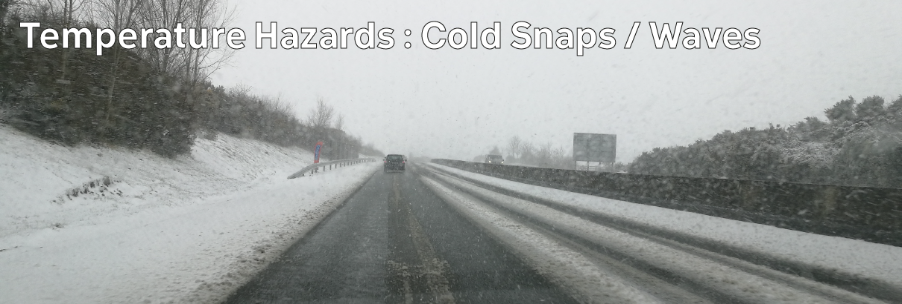

# Climate Hazards 4.01: Temperature Hazards : Cold Snaps / Waves

Earth is warming - but ironically, one of the main consequences is more periods of intense cold weather in certain places - including Ireland.

[Download slides](./assets/lectures/4-01_cold.pdf)



---

[Previous](./3-07.md) | [Course Home](./README.md) | [Temperature Hazards](./topic4.md) | [Next](./4-02.md)