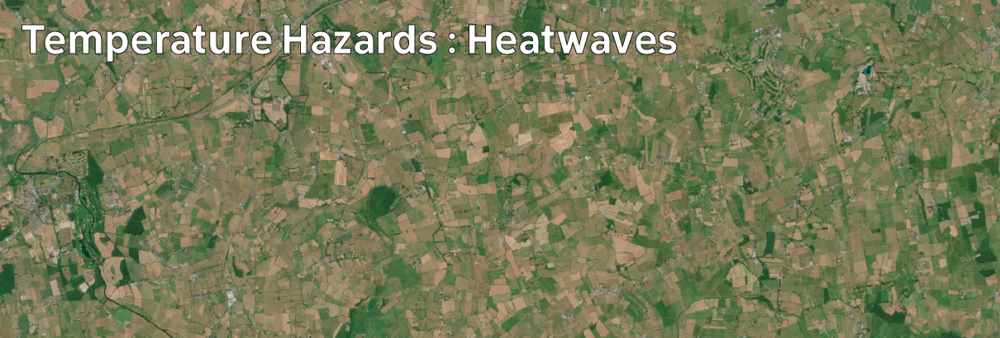

# Climate Hazards 4.02: Temperature Hazards : Heatwaves

Global warming also leads to more, and more frequent, regional heatwaves.

[Download slides](./assets/lectures/4-02_heat.pdf)



---

[Previous](./4-01.md) | [Course Home](./README.md) | [Temperature Hazards](./topic4.md) | [Next](./4-03.md)