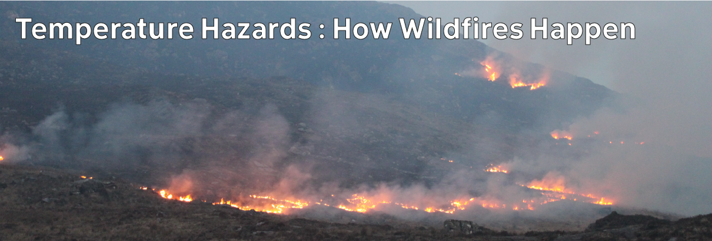

# Climate Hazards 4.04: Temperature Hazards : How Wildfires Happen

If plants lose too much moisture, it becomes much easier than you might think for them to burn.

[Download slides](./assets/lectures/4-04_wildfire.pdf)



---

[Previous](./4-03.md) | [Course Home](./README.md) | [Temperature Hazards](./topic4.md) | [Next](./4-05.md)