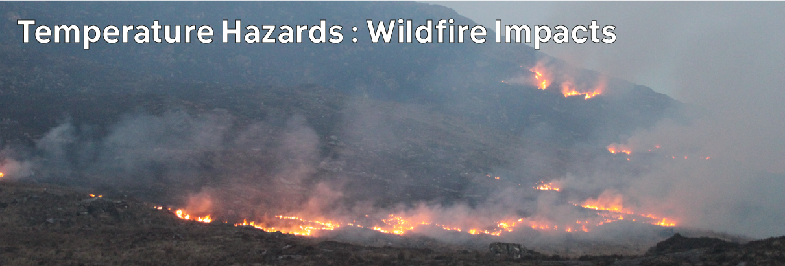

# Climate Hazards 4.05: Temperature Hazards : Wildfire Impacts

Wildfires aren't always bad - and we should stop trying to prevent them.

[Download slides](./assets/lectures/4-04_wildfire.pdf)



---

[Previous](./4-04.md) | [Course Home](./README.md) | [Temperature Hazards](./topic4.md) | [Next](./4-06.md)