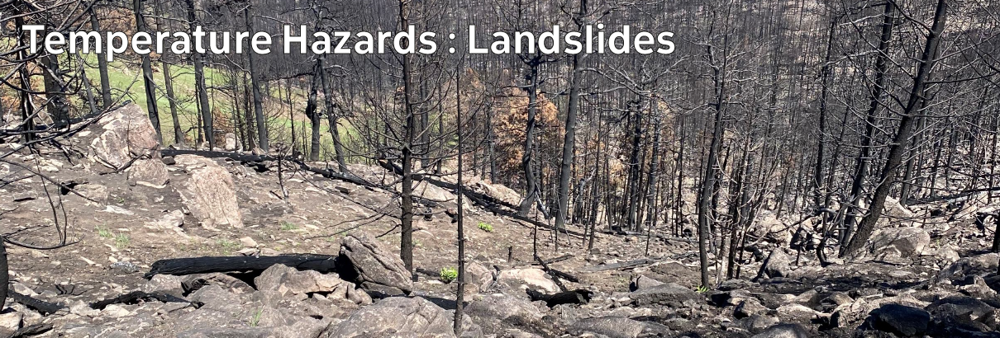

# Climate Hazards 4.06: Temperature Hazards : Landslides

One of the most dangerous consequences of wildfires is changing how water interacts with the land surface - which can lead to devastating and deadly landslides.

[Download slides](./assets/lectures/4-06_landslides.pdf)



---

[Previous](./4-05.md) | [Course Home](./README.md) | [Temperature Hazards](./topic4.md) | [Next](./topic5.md)