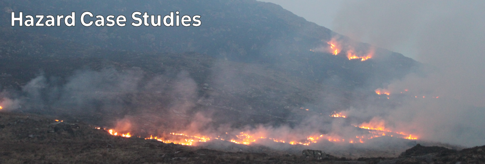

# Climate Hazards 5.03: Hazard Case Studies : Australian Bushfires, 2019-2020

## Media Articles

- BBC News: [Australia fires: A visual guide to the bushfire crisis](https://www.bbc.com/news/world-australia-50951043)

- National Geographic: [Wildfires have spread dramatically—and some forests may not recover](https://www.nationalgeographic.com/science/2020/01/extreme-wildfires-reshaping-forests-worldwide-recovery-australia-climate/)

- CBS News: [Australian bushfires are creating "pyrocumulonimbus" thunderstorms that can start more fires](https://www.cbsnews.com/news/fires-in-australia-pyrocumulonimbus-thunderstorm-clouds-victoria-sydney/)

- UN Environment Programme: [Ten impacts of the Australian bushfires](https://www.unenvironment.org/news-and-stories/story/ten-impacts-australian-bushfires)

- CNN: [Australian bushfires likely to happen again – and they could be even worse, inquiry warns](https://edition.cnn.com/2020/08/25/asia/australia-bushfires-likely-report-climate-scli-intl-scn/index.html)

## Research

- Filkov, A.I., Ngo, T., Matthews, S., Telfer, S., and Penman, T.D. 2020 Impact of Australia's catastrophic 2019/20 bushfire season on communities and environment. Retrospective analysis and current trends. *Journal of Safety Science and Resilience* **1** (1), 44-56. doi: [j.jnlssr.2020.06.009](https://doi.org/10.1016/j.jnlssr.2020.06.009)

## Videos



---



---



---



---



---

[Previous](./5-02.md) | [Course Home](./README.md) | [Hazard Case Studies](./topic5.md) | [Next](./5-04.md)