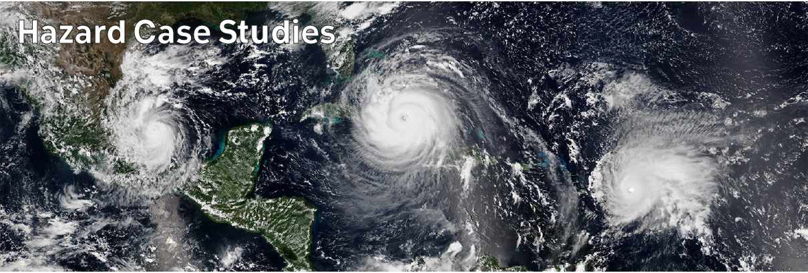

# Climate Hazards 5.05: Hazard Case Studies : Hurricane Harvey

## Media Articles

- Irish Times: [Petrol prices to rise 3c a litre due to Hurricane Harvey](https://www.irishtimes.com/business/transport-and-tourism/petrol-prices-to-rise-3c-a-litre-due-to-hurricane-harvey-1.3206351)

- Rice University: [After Hurricane Harvey, flood insurance created windfalls and fault lines for the middle class](https://kinder.rice.edu/urbanedge/after-hurricane-harvey-flood-insurance-created-windfalls-and-fault-lines-middle-class)

- Texas Observer: [How Disaster Recovery Overlooks the Poor](https://www.texasobserver.org/how-disaster-recovery-overlooks-the-poor/)

## Research

- National Hurricane Centre report [AL092017_Harvey](https://www.nhc.noaa.gov/data/tcr/AL092017_Harvey.pdf)

- Jonkman, S.N., Godfroy, M., Sebastian, A., and Kolen, B. 2018 Loss of life due to Hurricane Harvey. *Natural Hazards and Earth System Sciences* **18**, 1073–1078. doi: [10.5194/nhess-18-1073-2018](https://doi.org/10.5194/nhess-18-1073-2018)

- Zhang, W., Villarini, G., Vecchi, G.A., and Smith, J.A. 2018 Urbanization exacerbated the rainfall and flooding caused by hurricane Harvey in Houston. *Nature* **563**, 384–388. doi: [10.1038/s41586-018-0676-z](https://doi.org/10.1038/s41586-018-0676-z)

## Videos



---



---



---



---

[Previous](./5-04.md) | [Course Home](./README.md) | [Hazard Case Studies](./topic5.md) | [Next](./5-06.md)