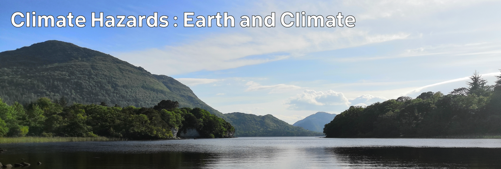

# Climate Hazards 1 : Earth and Climate

In order to understand what hazards we might face in the coming years, we need to start with how and why they are happening. So, to begin this course, we will start with some of the climate-relevant fundamentals of the main parts of the Earth system - the air of the atmosphere, the water of the hydrosphere, the rocks of the lithosphere, and the life of the biosphere.

We'll then build on that to look at the energy from the Sun which powers the Earth - what we get, what happens when it reaches us, and how the heat produced is distributed; including the main controls of our climate in the atmosphere and how we're affecting those. 

We'll conclude by covering the broad impacts of climate breakdown for the atmosphere, hydrosphere, and biosphere, setting the stage for exploration of particular hazards over the coming weeks.

## Lecture Topics

| -- | Topic |
| -- | -- |
| 1:01 | [The Atmosphere](./1-01.md) |
| 1:02 | [The Hydosphere](./1-02.md) |
| 1:03 | [The Lithosphere](./1-03.md) |
| 1:04 | [The Bioosphere](./1-04.md) |
| 1:05 | [Earth's Energy Balance](./1-05.md) |
| 1:06 | [Heat Distribution](./1-06.md) |
| 1:07 | [The Greenhouse Effect](./1-07.md) |
| 1:08 | [Climate Breakdown](./1-08.md) |

Previous | [Course Home](./README.md) | [Next](./1-01.md)