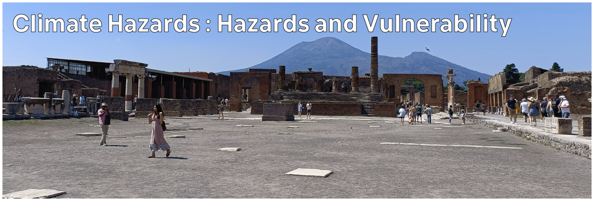

# Climate Hazards 2 : Hazards and Vulnerability

Storms, floods, heatwaves, and wildfires are all natural events. They aren't hazards because they happen: they're hazards if they can potentially affect people, buildings, infrastructure, and other elements of our society.

For this topic, we'll explore the societal aspect of climate hazards, looking at factors which turn natural events into hazards and disasters; the concepts of exposure, vulnerability, and risk; and what we mean by hazard adaption and mitigation.

## Lecture Topics

| -- | Topic |
| -- | -- |
| 2:01 | [Hazards and Disasters](./2-01.md) |
| 2:02 | [Risk, Exposure, and Vulnerability](./2-02.md) |
| 2:03 | [Voluntary and Involuntary Risk](./2-03.md) |
| 2:04 | [The World Risk Index](./2-04.md) |
| 2:05 | [Additional Resources](./2-05.md) |

[Previous](./topic1.md) | [Course Home](./README.md) | [Next](./2-01.md)