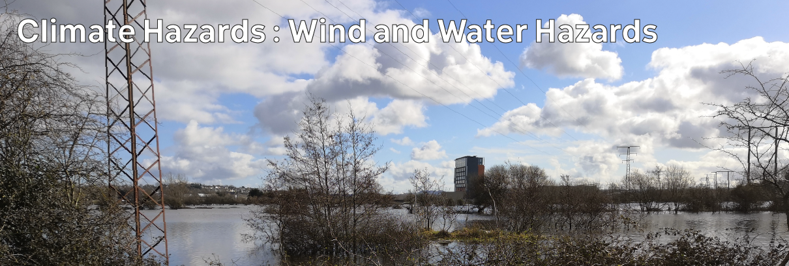

# Climate Hazards 3 : Wind and Water Hazards

In this topic, we'll look specifically at climate hazards from wind and water.

We'll cover a little more direct background on how weather happens, and cover hazards from storms and flooding from rainfall, rivers, and groundwater.

As well as the physical causes of these hazards, we'll also look at who and what might be at risk; the possibility of forecasting; the potential for adaption and mitigation; and what we expect from these hazards in the future.

## Lecture Topics

| -- | Topic |
| -- | -- |
| 3:01 | [Weather](./3-01.md) |
| 3:02 | [Mid-Latitude Storms](./3-02.md) |
| 3:03 | [Tropical Storms and Hurricanes](./3-03.md) |
| 3:04 | [Water Budgets](./3-04.md) |
| 3:05 | [Groundwater Flooding](./3-05.md) |
| 3:06 | [River Flooding](./3-06.md) |
| 3:07 | [Recurrence Intervals and Exceedance Probability](./3-07.md) |

[Previous](./topic2.md) | [Course Home](./README.md) | [Next](./3-01.md)