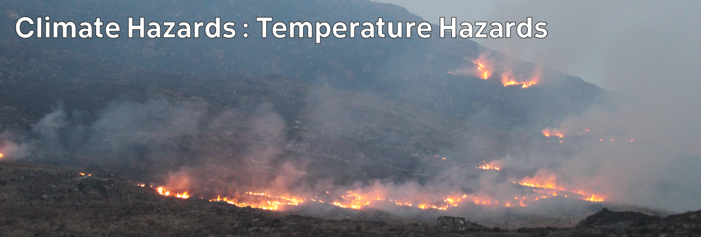

# Climate Hazards 4 : Temperature Hazards

In this topic, we'll look specifically at climate hazards from extreme temperatures - and actually not-so-extreme temperatures.

We'll build on our previous exploration of the atmosphere and biosphere with a little more directly relevant background, and explore particular hazards from extreme hot and cold temperatures.

We'll also look at droughts, and at wildfires; and consider landslides as a secondary impact in areas burned by wildfires.

As well as the physical causes, we'll also look at who and what might be at risk; the possibility of forecasting; the potential for adaption and mitigation; and what we expect from temperatures in the future.

## Lecture Topics

| -- | Topic |
| -- | -- |
| 4:01 | [Cold Snaps / Waves](./4-01.md) |
| 4:02 | [Heatwaves](./4-02.md) |
| 4:03 | [Drought](./4-03.md) |
| 4:04 | [How Wildfires Happen](./4-04.md) |
| 4:05 | [Wildfire Impacts](./4-05.md) |
| 4:06 | [Landslides](./4-06.md) |
| 4:07 | [Recurrence Intervals and Exceedance Probability](./4-07.md) |

## Links

FloodInfo flood risk maps: [floodinfo.ie/map/floodmaps/](https://www.floodinfo.ie/map/floodmaps/)

[Previous](./topic3.md) | [Course Home](./README.md) | [Next](./4-01.md)