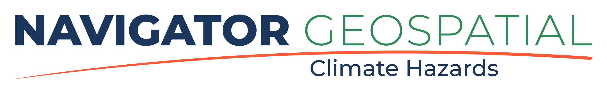

# Climate Hazards 6 : Climate Hazard Assessment and Mapping

These case studies, comprising a mix of news articles, research articles and reports, and videos, have been curated to allow you to learn more about particular kinds of hazards through looking at examples, and also to highlight some specific aspects of risk and vulnerability.

## Content

| -- | Content |
| -- | -- |
| 6:01 | [Report structure](./6-01.md) |
| -- | [Climate Hazard Assessment](./assessment.md) |

## Tutorials

Thursday 27 November, 1900-2000. [Join/watch recording](https://teams.microsoft.com/l/meetingrecap?driveId=b%21gCfmRFSHm0S_Na5rsw9LBuKEbCJZOeFPqQjRjweh_9It8pd1pBrhQpsL234wLpe8&driveItemId=01JDBJEUS3XVWSL7LKTBHLKIFGHK7YHIIZ&sitePath=https%3A%2F%2Fulcampus-my.sharepoint.com%2F%3Av%3A%2Fg%2Fpersonal%2Fbreandan_macgabhann_ul_ie%2FIQBbvW0l_WqYTrUgpjq_g6EZAQNK5162mPQjc3soNlmwETs&fileUrl=https%3A%2F%2Fulcampus-my.sharepoint.com%2Fpersonal%2Fbreandan_macgabhann_ul_ie%2FDocuments%2FRecordings%2FGY5022%2520Climate%2520Hazards%2520-%2520Tutorial-20251127_193617-Meeting%2520Recording.mp4%3Fweb%3D1&iCalUid=040000008200E00074C5B7101A82E00807E90B1BBF86BCB14544DC01000000000000000010000000DAB344DC66028E4088A489FFA85B2D6E&masterICalUid=040000008200e00074c5b7101a82e00800000000bf86bcb14544dc01000000000000000010000000dab344dc66028e4088a489ffa85b2d6e&threadId=19%3Ameeting_Y2JhZjJkYzItOGFhMC00N2ZhLTkyM2QtZjFjZThhN2YyZTU4%40thread.v2&organizerId=be67ec9b-5672-42bd-8156-41b43b8be170&tenantId=0084b924-3ab4-4116-9251-9939f695e54c&callId=9f68ec02-1692-486a-9d69-93d417d70b62&threadType=meeting&meetingType=Recurring&subType=RecapSharingLink_RecapCore)

Thursday 04 December, 1900-2000. [Join/watch recording](https://teams.microsoft.com/l/meetingrecap?driveId=b%21gCfmRFSHm0S_Na5rsw9LBuKEbCJZOeFPqQjRjweh_9It8pd1pBrhQpsL234wLpe8&driveItemId=01JDBJEUTAFU6KOMYHBVD3UWGTJ3N5X2U6&sitePath=https%3A%2F%2Fulcampus-my.sharepoint.com%2Fpersonal%2Fbreandan_macgabhann_ul_ie%2FDocuments%2FRecordings%2FGY5022%2520Climate%2520Hazards%2520-%2520Tutorial-20251204_190809-Meeting%2520Recording.mp4&fileUrl=https%3A%2F%2Fulcampus-my.sharepoint.com%2Fpersonal%2Fbreandan_macgabhann_ul_ie%2FDocuments%2FRecordings%2FGY5022%2520Climate%2520Hazards%2520-%2520Tutorial-20251204_190809-Meeting%2520Recording.mp4&iCalUid=040000008200E00074C5B7101A82E00807E90B1BBF86BCB14544DC01000000000000000010000000DAB344DC66028E4088A489FFA85B2D6E&masterICalUid=040000008200e00074c5b7101a82e00800000000bf86bcb14544dc01000000000000000010000000dab344dc66028e4088a489ffa85b2d6e&threadId=19%3Ameeting_Y2JhZjJkYzItOGFhMC00N2ZhLTkyM2QtZjFjZThhN2YyZTU4%40thread.v2&organizerId=be67ec9b-5672-42bd-8156-41b43b8be170&tenantId=0084b924-3ab4-4116-9251-9939f695e54c&callId=84a3ca42-3905-441e-b27f-7c996a92792b&threadType=meeting&meetingType=Recurring&subType=RecapSharingLink_RecapCore)

### Tutorial Links:
- Climate-ADAPT Case study explorer: [link](https://climate-adapt.eea.europa.eu/en/knowledge/tools/case-study-explorer)

- OpenStreetMap: [link](https://www.openstreetmap.org/)

- Open Infrastructure Map: [link](https://openinframap.org/)

- Tidal Observations (IMOS): [link](https://www.marine.ie/site-area/data-services/real-time-observations/tidal-observations-imos)

[Previous](./5-08.md) | [Course Home](./README.md) | [Next](./6-01.md)